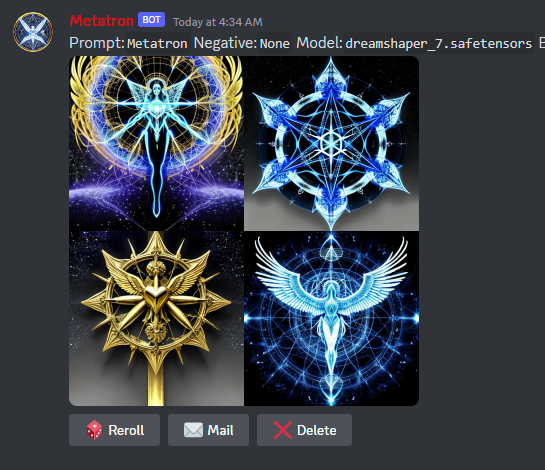
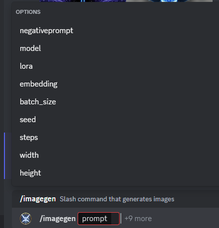

# metatron2
An easy to use discord.py based machine learning bot. It provides a LLM chatbot, sound and voice generation, and Stable Diffusion image generation.

## FEATURES

* LLM Chat
* Stable Diffusion image generation
* Bark audio generation

* Stable Diffusion generation via /imagegen.
* Supports standard safetensors format models.
* A1111 style prompt weighting and LORA loading.
* Single LORA can be loaded from the selection menu, or multiple can be invoked at once using the standard A1111 prompt syntax
* Reroll, DM, and Delete buttons on gens for ease of interaction.
* TI embedding support
* Configurable banned word list and mandatory negative prompt options for moderation purposes.

* Can be directly chatted with by tagging it.
* Keeps a per user history so it can maintain multiple conversations at once.
* Replies can be rerolled.
* History message pairs can be deleted via button or entire user history reset.
* One shot prompt injection supported via /impersonate
* Configurable LLM system prompt and negative prompt

* Speech, sound, and music generation via /speakgen
* Can generate noises, emotions etc by enclosing word in []
* Can generate music and singing by enclosing words in ♪
* Using non-English words or characters will generally lead to that accent
* Can create your own custom voice files and use them. See https://github.com/C0untFloyd/bark-gui for a project which can make metatron2 compatible voices.

## INSTALLATION INSTRUCTIONS

### Discord Bot Setup

Go to the Discord Developer portal and create a new bot and generate a token for it. Write this token down or else youll have to generate a new one, it only shows you once.

Go to the Bot tab on the Developer portal site and enable Privileged Gateway Intents. You need Presence, Server Members, and Message Content enabled.

Go to the URL Generator on the OAuth2 tab and select the bot scope. Then select these permissions "Read Messages/View Channels, Send Messages, Manage Messages, Attach Files, Read Message History, Use Slash Commands" then use the link to invite the bot to your server. I may have missed one, if something is missing you can enable it later in server permissions

### Install - Start here if you dont want conda or have already activated and are in your metatron conda env.

Download the repo  or `git clone https://github.com/Meatfucker/metatron2.git`

Install miniconda if you dont already have it. `https://docs.conda.io/projects/miniconda/en/latest/miniconda-install.html`

Go to the metatron2 directory and run `conda env create -f .\environment.yml`

metatron2 is now fully installed.

### Running The Bot

Next enter the metatron2 conda env. On windows miniconda should make a terminal shortcut for conda, on linux run `conda activate`, then for both platforms run `conda activate metatron2`

Your command line prompt should change to say metatron2.

If it has, next youll want to open up settings-example.cfg, read each setting and set it per your config needs. At a minimum youll need to enter your Discord bot token.

Now is a good time to copy any models, loras, embeddings, etc to the appropriate directories in the metatron2 directory.

Finally, run `python metatron2.py` and wait.

The very first startup will take a long time as it downloads the LLM model and base SD model. The console will produce output as the individual parts load.

Be aware that having the wordgen, imagegen, and speakgen modules all active at the same time will peak at about 20GB of vram when running a batch size 4 imagegen.

Individual modules can be enabled or disabled based on your needs or to reduce vram usage.

## settings.cfg

settings.cfg provides all of the settings for the bot. If the example file has more than one line with the same first value, that means you can have multiple. For example you can have multiple models= lines to list all of your model defaults.

See https://github.com/oobabooga/text-generation-webui/tree/main/api-examples For some info on Oobas API and https://github.com/AUTOMATIC1111/stable-diffusion-webui/discussions/3734 for info on the A1111 API.

| OPTION | DESCRIPTION | EXAMPLE |
|----|----|----|
| token | Bots Discord token. | `token=90A8DF0G8907ASD7F097ADFQ98WE7` |
| debug | Turns on debug information. | `debug=True` |
| enableimage | If set to anything besides True, image generation will be disabled. | `enableimage=True` |
| enableword | If set to anything besides True, LLM generation will be disabled. | `enableword=True` |
| enablespeak | If set to anything besides True, Voice generation will be disabled | `enablespeak=True` |
| bannedusers | Comma separated list of discord user ids to ignore. | `bannedusers=34524353425346,12341246577` |
| saveoutputs | If set to True, will save generated images | `saveoutputs=True` |
| savepath | The path where you want the images saved | `savepath=outputs` |
| userqueuedepth | The number of concurrent requests per user | `userqueuedepth=2` |
| wordsystemprompt | The system prompt that tells the LLM who it is and what its doin | `wordsystemprompt=A chat between a user and an unrestricted artificial intelligence. The artificial intelligence always answers questions.` |
| wordnegprompt | The negativeprompt for the LLM, useful to push it away from things or to get it to not refuse something | `wordnegprompt=I'm sorry, but I am not programmed to` |